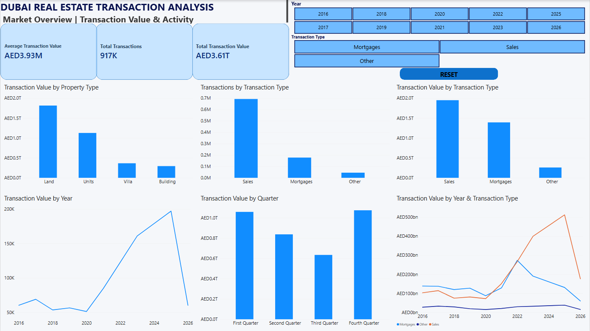
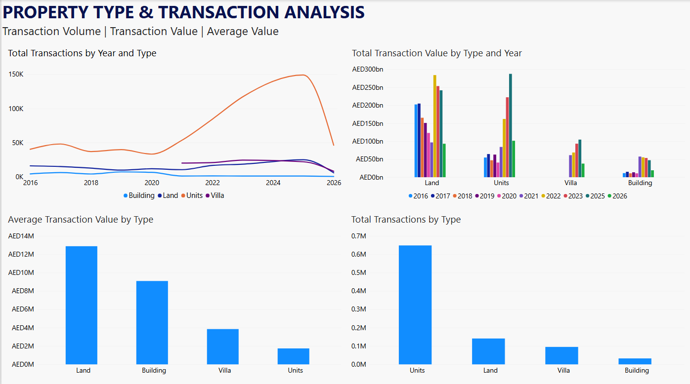
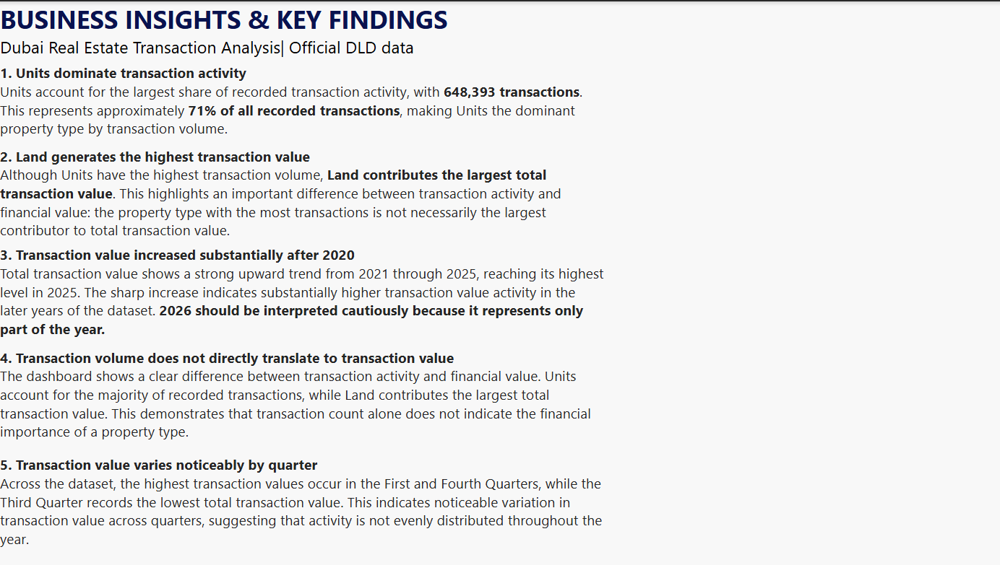

# Dubai Real Estate Data Analysis

End-to-end Dubai real estate transaction analysis using official Dubai Land Department (DLD) data, Python, SQL, Power BI, and business insights.

## 📌 Project Overview

This project analyzes Dubai real estate transaction data to understand transaction activity, transaction value, property types, market trends, and key business patterns.

The project combines:

- Official Dubai Land Department (DLD) data for market analysis
- Python/Pandas for data exploration and preparation
- PostgreSQL/SQL for analytical querying
- Power BI for interactive dashboard development
- Business analysis to translate data into actionable insights

## 🎯 Objectives

The main objectives of this project are to:

- Analyze Dubai real estate transaction activity
- Examine transaction value trends over time
- Compare property types and transaction types
- Analyze transaction values by area and property characteristics
- Calculate AED per square meter
- Identify unusual and extreme observations
- Clean and validate a messy real estate dataset
- Build an interactive Power BI dashboard
- Develop business insights from the analysis
- 
- ## 🛠️ Tools & Technologies

- **Python / Pandas** — Data cleaning, exploration, validation, and analysis
- **PostgreSQL / SQL** — Data querying, aggregation, trend analysis, and advanced SQL analysis
- **Power BI** — Interactive dashboard development and data visualization
- **Jupyter Notebook** — Python-based exploratory data analysis
- **Git & GitHub** — Version control and project documentation
- **VS Code** — Development environment

- ## 💡 Key Business Insights

The analysis of official Dubai Land Department (DLD) data produced the following key findings:

- **Units dominate transaction activity** — Units account for approximately 71% of recorded transactions, with 648,393 transactions, making them the dominant property type by transaction volume.

- **Land generates the highest transaction value** — Although Units have the highest transaction volume, Land contributes the largest total transaction value, highlighting the difference between transaction activity and financial value.

- **Transaction value increased substantially after 2020** — Total transaction value shows a strong upward trend from 2021 through 2025, reaching its highest level in 2025. 2026 should be interpreted cautiously because it represents only part of the year.

- **Transaction volume does not directly translate to transaction value** — The property type with the highest number of transactions is not necessarily the largest contributor to total transaction value.

- **Transaction values vary by quarter** — The First and Fourth Quarters record the highest total transaction values, while the Third Quarter records the lowest, indicating noticeable quarterly variation.

- ## 📊 Dashboard Preview

The Power BI dashboard provides an interactive view of Dubai real estate transaction activity, transaction value, property types, trends, and key business insights.

### Page 1 — Market Overview



### Page 2 — Property Type & Transaction Analysis



### Page 3 — Business Insights & Key Findings



## 📂 Dataset Information

This project uses two separate datasets for different analytical purposes.

### 🏛️ Official Dubai Land Department (DLD) Data

The official dataset is used for the primary Dubai real estate market analysis and Power BI dashboard.

- Source: Dubai Land Department (DLD)
- Coverage: 2016–2026
- Contains aggregated transaction records by property type, transaction type, year, and quarter
- Used for market trends, transaction activity, transaction value analysis, and business insights
- Official data is kept separate from the synthetic dataset

### 🧪 Synthetic Real Estate Dataset

A separate synthetic dataset was created to practice real-world data analyst workflows involving messy data.

It was used for:

- Data cleaning and validation
- Missing-value handling
- Duplicate detection and removal
- Data-quality checks
- PostgreSQL / SQL analysis
- Outlier investigation
- Advanced SQL techniques

**Important:** The synthetic dataset is used for analytical practice and SQL/cleaning demonstrations. It should not be interpreted as official Dubai real estate market data.

## 🗂️ Project Structure

```text
dubai-real-estate-data-analysis/
│
├── data/
│   ├── official/
│   │   └── Dubai_Real_Estate_Clean_English.csv
│   │
│   └── synthetic/
│       ├── Dubai_Real_Estate_Cleaned.csv
│       └── Dubai_Real_Estate_Synthetic_Messy.csv
│
├── Python/
│   └── dubai_temp2.ipynb
│
├── sql/
│   └── dubai_real_estate_analysis.sql
│
├── .vscode/
│   ├── powerbi/
│   │   └── dubai real estate dashboard.pbix
│   └── settings.json
│
├── screenshots/
│
├── documentation/
│
├── .gitignore
└── README.md
